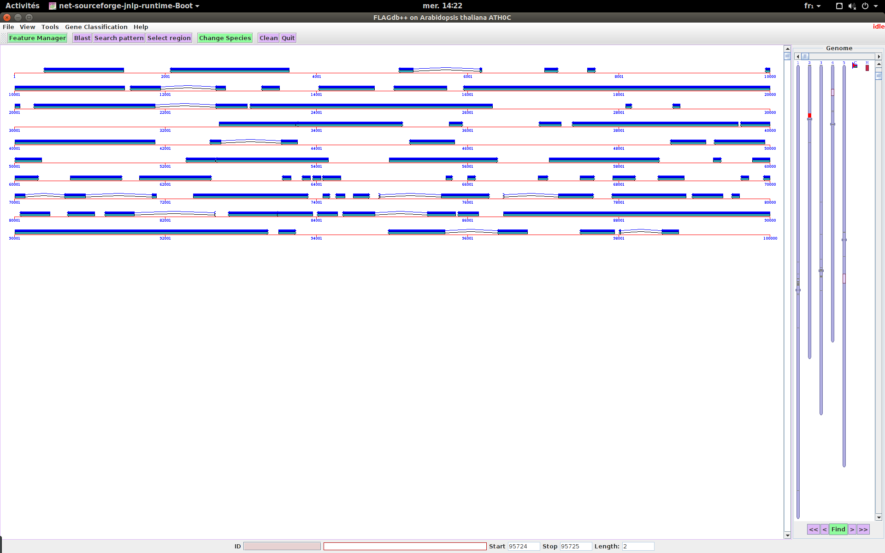
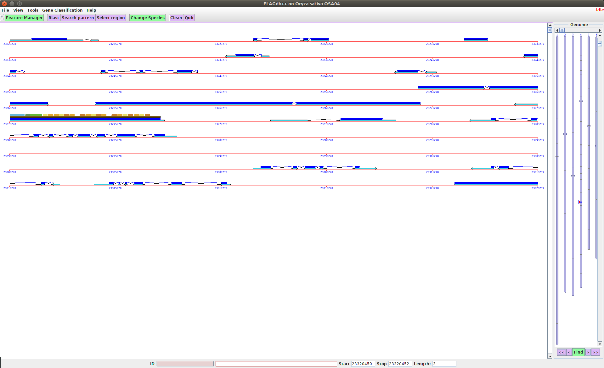
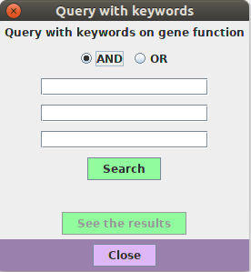

= SeeDev

== Application goal

One of the main goal of the SeeDev TDM use case is aimed at researchers in plant breeding, especially those interested in plant reproduction and seed development. The main objective of research laboratories involved in plant development research is the understanding of biological mechanisms at different scales: molecular, biological, physiological and the whole plant in its environment (i.e. in field). They need to know about relations between different biological entities, such as gene, protein and the conditions in which the regulation occur (e.g. tissue and so on). A better understanding of regulations allows improvement of seed development that is the basis for many industrial uses. This kind of information is described in the literature but not in structured databases that the user can query and cannot be found or directly extracted from experimental or bioinformatics data. Biologists regularly express a need for an improved access to documents related to their study subjects within a familiar environment.

The integration of a TDM module aims at improving the data discovery, and at assisting users in their bibliography search. The TDM module will provide normalization of unstructured entities and enhanced search capabilities. Here analysis means not only the extraction of the relevant spans of text, but also the normalization or categorization with reference resources (e.g. Gene and Protein list from TAIR).

== Application description

The end-user can use a semantic search engine to search the extracted information. 
The corpus is composed of 45 full scientific texts (including whose from SeeDev BioNLP-ST 2016 [Chaix2016]), and 2000 abstracts from WebOfKnowledge. This version of the application consists of the automatic recognition and normalization of Protein (17968), Gene (9490), theirs families (188), and RNA (55).The Gene and Protein entities are normalized according to TAIR list (realease 10). The Gene and Protein families are normalized according to TAIR list and, if not available, by the gene/protein identifiant from TAIR plus the word "family". The RNA are normalized from the miRTarBase list. 
The TDM components and the workflow application are deployed on Alvis platform at INRA MaIAGE lab and available on-line on GitHub. 

Resulting annotations are made browsable in the FLAGdb++ application which is developped by the IPS2 team [Dèrozier2011].

= FLAGdb++

== User profile

The user of the FLAGdb++ application is a plant biologist that wants to collect or cross-check information about Genes, Proteins and their respective families, but also RNA.

== Architecture of the application

The relevant corpus has been fully pre-processed by AlvisNLP pipeline and indexed in the FLAGdb++ database and made available in the visualisations provided by FLAGdb++.

== User manual, How-to

=== Launching the application

The FLAGdb++ application is a Java web application, available at http://tools.ips2.u-psud.fr/projects/FLAGdb++/HTML/ and that may be started by opening the following URL with a browser http://tools.ips2.u-psud.fr/projects/FLAGdb++/Appli/FLAGdb.jnlp.

[[img-sunset]]
// .FLAGDB++ start page//

=== Browsing

In FLAGdb++, data is browsed by right-clicking on the interface or by entering a query in the keyword search window.

Right-clicking on a DNA sequence or a RNA sequence displays the following contextial menu: 

[[img-sunset]]
// .FLAGDB++ right-click interaction//

The __Bibliography__ button opens a window with text mining annotations in which the entity selected by right click appears (see section __Results__ below).

In the keyword search window (opened by clicking on __Tools__ > Query with keywords), the user may enter the name of an entity or one of its synonyms (the synonyms of Genes from the TAIR list can be used).

[[img-sunset]]
// .FLAGDB++ keyword search //

[[img-sunset]]

=== Results

Relations between the selected named entity and other entities are made visualisable in a table. The colums of this table contain:

- the canonical name of the entity
- the name of the relation
- the canonical name of the second entity
- the total number of occurences of this relation and the number of publications in which this relation has been predicted.

The total number of occurences and publications in which the relation is found is provided to the user as a way to identify relations that decipher relations that are widely admitted from low signal.

[[img-sunset]]
// .Results table //
image::images/FLAGdb++_results.png[]

=== Reference

[bibliography]
- [Dèrozier2011] Dèrozier, S., Samson, F., Tamby, JPh., Guichard, C., Brunaud, V., Grevet, P., Gagnot, S., Label, P., Leplé, J.-C., Lecharny, A., Aubourg, S. (2011, March) Exploration of plant genomes in the FLAGdb++ environment.  Plant Methods 2011
