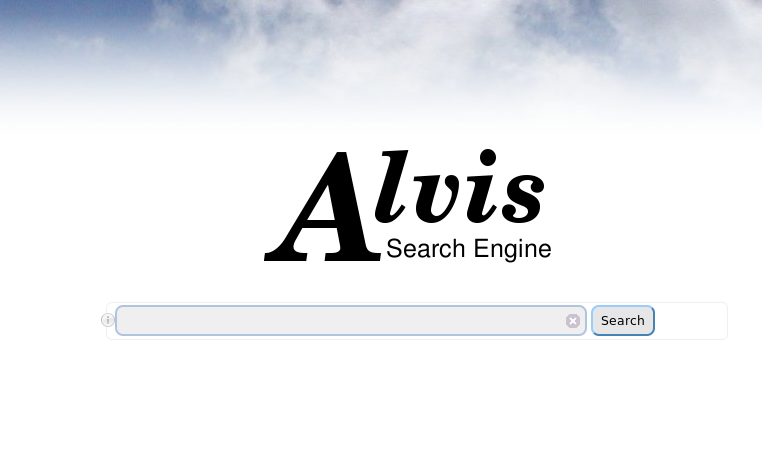
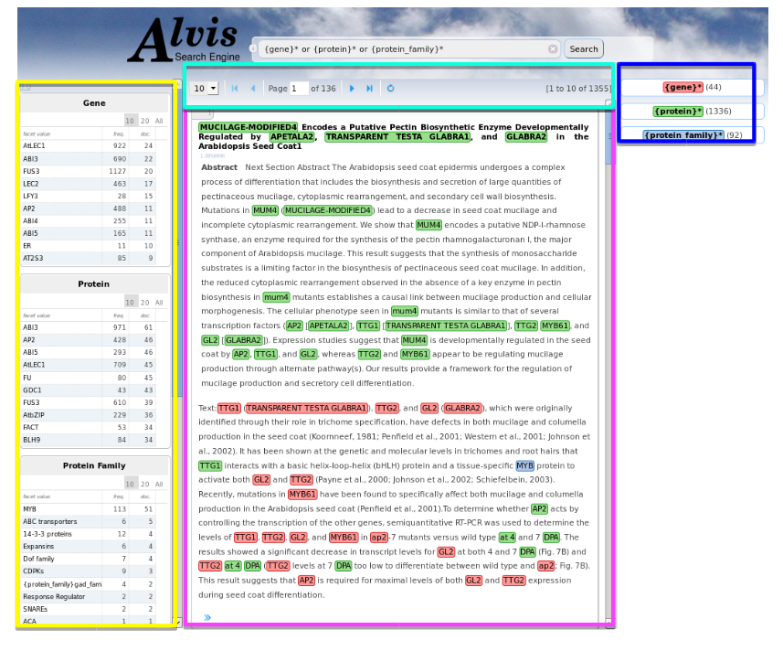
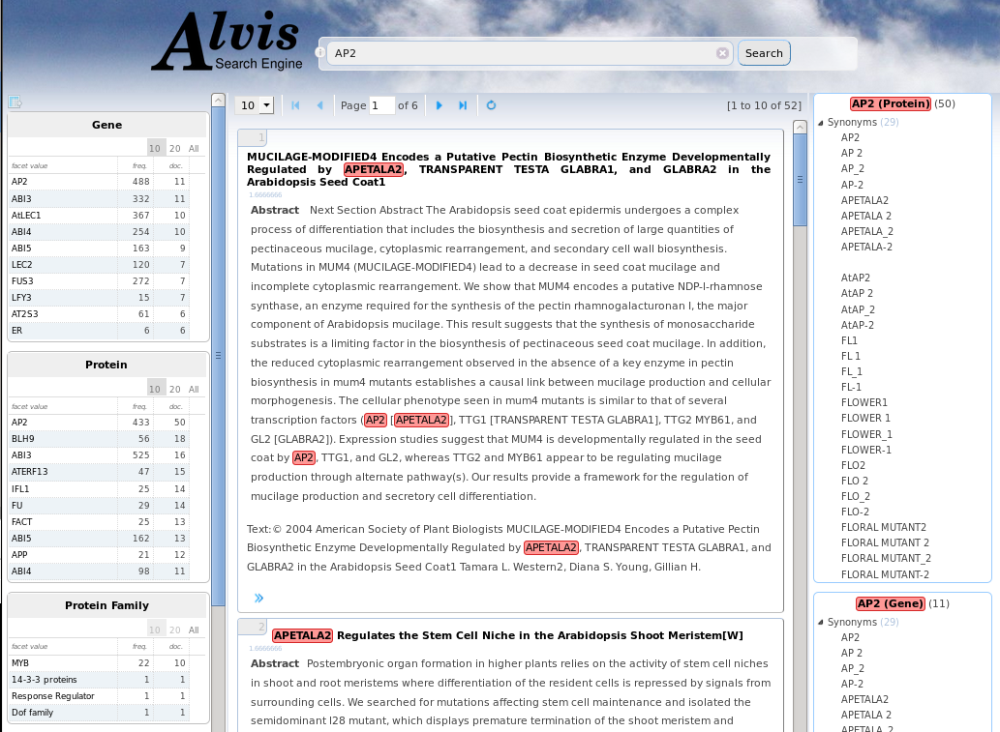

= SeeDev

== Application goal

One of the main goal of the SeeDev TDM use case is aimed at researchers in plant breeding, especially those interested in plant reproduction and seed development. The main objective of research laboratories involved in plant development research is the understanding of biological mechanisms at different scales: molecular, biological, physiological and the whole plant in its environment (i.e. in field). They need to know about relations between different biological entities, such as gene, protein and the conditions in which the regulation occur (e.g. tissue and so on). A better understanding of regulations allows improvement of seed development that is the basis for many industrial uses. This kind of information is described in the literature but not in structured databases that the user can query and cannot be found or directly extracted from experimental or bioinformatics data. Biologists regularly express a need for an improved access to documents related to their study subjects within a familiar environment.

The integration of a TDM module aims at improving the data discovery, and at assisting users in their bibliography search. The TDM module will provide normalization of unstructured entities and enhanced search capabilities. Here analysis means not only the extraction of the relevant spans of text, but also the normalization or categorization with reference resources (e.g. Gene and Protein list from TAIR).

== Application description

The end-user can use a semantic search engine to search the extracted information. 
The corpus is composed of 45 full scientific texts (including whose from SeeDev BioNLP-ST 2016 [Chaix2016]), and 2000 abstracts from WebOfKnowledge. This version of the application consists of the automatic recognition and normalization of Protein (17968), Gene (9490), theirs families (188), and RNA (55).The Gene and Protein entities are normalized according to TAIR list (realease 10). The Gene and Protein families are normalized according to TAIR list and, if not available, by the gene/protein identifiant from TAIR plus the word "family". The RNA are normalized from the miRTarBase list. 
The TDM components and the workflow application are deployed on Alvis platform at INRA MaIAGE lab and available on-line on GitHub. 
Alvis Semantic Information Retrieval engine is web application, publicly available usable with any web browser. 

= SeeDev

== User profile

The user of the SeeDev search engine is a plant biologist that want to collect information about Gene, Protein, and their respective families, but also RNA. 

== Architecture of the application

The relevant corpus has been fully pre-processed by AlvisNLP pipeline and indexed for query through AlvisIR engine available from any web browser.

== User manual, How-to

=== Launching the application

The URL to run AlvisIR search engine on Microbial Biodiversity is : 
http://bibliome.jouy.inra.fr/demo/seedev/alvisir/webapi/search

[[img-sunset]]
// .AlvisIR search engine//

A click on the i at the left of the query field display the query language. 

[[img-sunset]]
//.A click//
image::images/alvisIR_home_Aclick.png[]

=== Query

The query is typed in the query field.

[[img-sunset]]
// .The Query //
image::images/alvisIR_home_TheQuery.png[]

=== Results

The results of the query are displayed in four frames:
the query interpretation (blue frame)
the list of hits (pink frame)
the facets (yellow frame)
the page number (cyan frame).

[[img-sunset]]
// .The Results //

=== Query interpretation 

The query is interpreted according to the syntax of the query language. The terms of the query that designate gene and protein list with respect to the TAIR list are interpreted as concepts of these lexicons. {protein-family}* is interpreted as the matches with concept from the Protein family list from TAIR, but also all term identified as {protein} + term which indicates the family appartenance. 
The query interpretation frame could displays the interpretation of query terms as concepts, the list of their synonyms and subconcepts (more specific). The number of occurrences for each term is also displayed. All documents that are indexed by a synonym or a more specific term of the query term are retrieved if they respect the relationship constraint if ever.  
The number of hits displayed per page can be 10, 20, 30 or 50.
[[img-sunset]]
// .The Query interpretation //

=== Hits

Each hit represent a document that verify the query constraints. It is composed of 
the title of the document, (click on the title display the full reference on PubMed  or DOI websites.)
the text of the abstract and 
an extract of the fulltext if matches and if available
the list of the indexes that is displayed by a click on the >> symbol.

=== Facets

There is one facet table per index type: Gene, Protein, Protein Family Gene Family, RNA and Journals and Publication years. They give information about the set of retrieved hits. Each table gives the list of values, the total frequency and the number of documents. 10 (by default), 20 or all of them can be displayed. Click on any line refines the query: it adds to the query the term in the facet that has been selected. Results could be viewed by a click on the   symbol.
[[img-sunset]]
// .The view of results //
 

== Further information

This TDM application will be integrated into the FLAGdb++ (http://tools.ips2.u-psud.fr/projects/FLAGdb%2B%2B/HTML/index.shtml), a reference tool for biologists who work on the genetics of plants.

=== Reference

[bibliography]
- [Chaix2016] Chaix, E., Dubreucq, B., Fatihi, A., Valsamou, D., Bossy, R., Ba, M., ... & Nédellec, C. (2016, August). Overview of the regulatory network of plant seed development (seedev) task at the bionlp shared task 2016. In Proceedings of the 4th BioNLP shared task workshop. Berlin: Association for Computational Linguistic (pp. 1-11).

